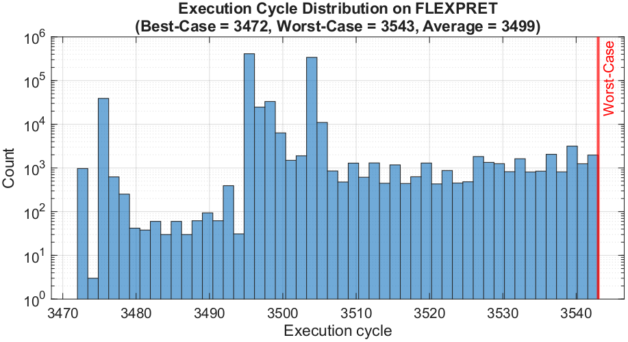
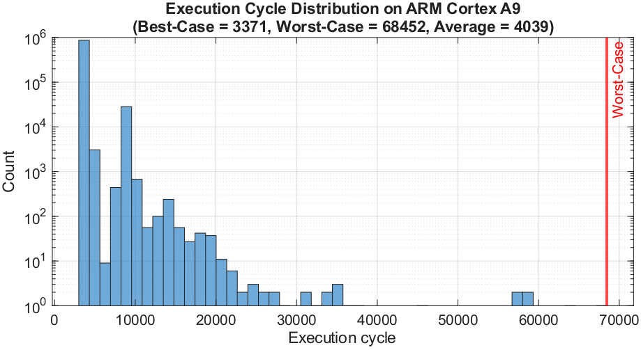

# Supplementary Material: Hard Real-Time Embedded Implementation of Closed-Loop Gastric Pacemaker

This repository contains supplementary data for our IEEE EMBS conference paper, specifically detailing the compiler optimization constraints and the Worst-Case Execution Time (WCET) analysis performed without compiler optimizations (`-O0`).

## Compiler Optimization Constraints

During the WCET analysis of the pacemaker's processing pipeline using the Heptane static analysis tool, we evaluated multiple compiler optimization levels:

* **-O2 Optimization:** Compilation failed due to assembler errors related to Call Frame Information (CFI) directives during Heptane's extraction phase. 
* **-O1 Optimization:** Successfully compiled and analyzed. Because this represents a more realistic embedded deployment scenario, the `-O1` results (Static WCET: 1872 cycles) are featured as the primary results in our main paper.
* **-O0 (No Optimization):** Successfully compiled and analyzed. The Heptane documentation implicitly recommends avoiding optimizations that change loop ordering, making `-O0` the default standard to ensure the analyzed Control Flow Graph (CFG) perfectly matches actual execution. The detailed `-O0` results are preserved below.

## Baseline WCET Analysis (-O0 Compilation)

The results below demonstrate the temporal determinism of the FlexPRET precision-timed architecture compared to a general-purpose ARM Cortex-A9 processor when running the unoptimized pacemaker logic.

### 1. FlexPRET Execution Cycles (-O0)
* **Static WCET (Heptane):** 3,996 cycles
* **Measured Worst-Case (HiL):** 3,543 cycles
* **Measured Best-Case (HiL):** 3,472 cycles
* **Pessimism Margin:** 453 cycles (11.3%)

The FlexPRET processor showed a highly concentrated distribution with minimal temporal jitter. The static WCET provided a tight, reliable upper bound with only an 11.3% pessimism margin.

### 2. ARM Cortex-A9 Execution Cycles (-O0)
* **Measured Worst-Case (HiL):** 68,452 cycles
* **Measured Best-Case (HiL):** 3,371 cycles

In contrast, the ARM Cortex-A9 exhibited a massive execution time spread. While the best-case was slightly faster than FlexPRET, the worst-case stretched to 68,452 cycles due to the non-deterministic nature of the general-purpose architecture and OS scheduling.

